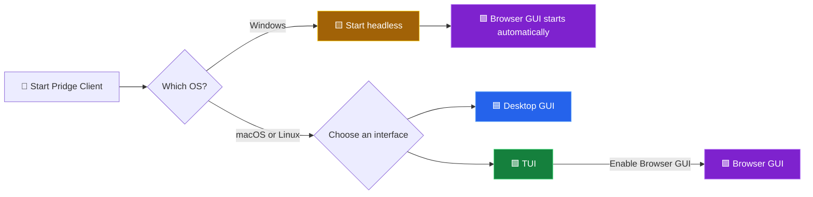

# Pridge Client

Pridge Client is the local desktop application that connects an office computer to Pridge Server, receives print jobs, and sends them to local printers as unchanged RAW data or through an installed system printer driver.

This repository contains the first Python implementation. The server protocol is intentionally simple and language-neutral so future clients written in C++, Rust, C#, Go, or another language can reuse the same API.

Self-contained Native (Nuitka) and PyInstaller release builds for Windows, macOS, and Linux desktop are documented in [BUILDING.md](BUILDING.md).

## Installation

### 📦 Native application

Native releases are self-contained applications compiled with Nuitka. They do not require Python. Download the package for your computer from [GitHub Releases](https://github.com/sayehava/Pridge-Client/releases/latest).

| Operating system | Download | Install |
| --- | --- | --- |
| 🪟 Windows x64 | `Pridge-Client-Native-Setup-x64.exe` | Run the installer, then open Pridge Client from the Start menu. |
| 🪟 Windows x64 portable | `Pridge-Client-Native-Windows-x64-Portable.zip` | Extract the entire ZIP, then run `Pridge Client.exe`. |
| 🍎 macOS Apple Silicon | `Pridge-Client-Native-macOS-arm64.dmg` | Open the DMG and drag Pridge Client into Applications. |
| 🍎 macOS Intel | `Pridge-Client-Native-macOS-x86_64.dmg` | Open the DMG and drag Pridge Client into Applications. |
| 🐧 Linux x86_64 | `Pridge-Client-Native-Linux-x86_64-Ubuntu22.04+.tar.gz` | Extract the archive and run `Pridge Client` inside its directory. |

### 🧰 PyInstaller application

Each operating system also has a self-contained package with `PyInstaller` in its filename. Installation is identical to the Native package for that platform, and Python is not required. The two variants are independent builds, so users can try the other variant if one is incompatible with their system.

### 🐍 Python source installation

Use Python 3.9 or newer.

```bash
python3 -m pip install -e .
```

Optional platform packages:

- Windows printing: `python3 -m pip install -e ".[windows]"`
- Linux CUPS integration: `python3 -m pip install -e ".[linux]"`
- Secure token storage: `python3 -m pip install -e ".[secure]"`

The application can run without the optional secure storage package. If `keyring` is unavailable, the client token is stored in a restricted local fallback file.

## Running

### 🎨 Pick your mode

| Color | Mode | What you get |
| --- | --- | --- |
| 🟦 | Desktop GUI | The native pywebview application |
| 🟨 | Headless | The print service without a desktop window |
| 🟩 | TUI | An interactive terminal dashboard |
| 🟪 | Browser GUI | The full interface at a private localhost address |

| Operating system | 🟦 Desktop GUI | 🟨 Headless | 🟩 TUI | 🟪 Browser GUI |
| --- | :---: | :---: | :---: | :---: |
| 🪟 Windows | ✅ | ✅ | ❌ | ✅ Automatic with headless mode |
| 🍎 macOS | ✅ | ✅ | ✅ | ✅ Optional from TUI Settings |
| 🐧 Linux | ✅ | ✅ | ✅ | ✅ Optional from TUI Settings |



### 🪟 Windows

#### 🟦 Desktop GUI

Open **Pridge Client** from the Start menu or double-click the application. From PowerShell, use the command that matches your installation:

| Installation | Command |
| --- | --- |
| Installed application | `& "$env:ProgramFiles\Pridge Client\Pridge Client.exe"` |
| Portable application | `& ".\Pridge Client.exe"` |
| Python package | `py -m pridge_client` |

#### 🟨 Headless + 🟪 Browser GUI

| Installation | PowerShell command |
| --- | --- |
| Installed application | `Start-Process "$env:ProgramFiles\Pridge Client\Pridge Client.exe" -ArgumentList "--headless"` |
| Portable application | `Start-Process ".\Pridge Client.exe" -ArgumentList "--headless"` |
| Python package | `py -m pridge_client --headless` |

Windows starts the Browser GUI automatically in headless mode and reports its exact local address, normally `http://127.0.0.1:8765`. Open that address in any browser on the same computer. Use **Quit** in the Browser GUI to stop the service.

> 🚫 The terminal TUI is not available on Windows. Headless Windows users manage the app through the Browser GUI instead.

### 🍎 macOS

| Mode | Packaged application | Python package |
| --- | --- | --- |
| 🟦 Desktop GUI | `open -a "Pridge Client"` | `python3 -m pridge_client` |
| 🟨 Headless | `"/Applications/Pridge Client.app/Contents/MacOS/Pridge Client" --headless` | `python3 -m pridge_client --headless` |
| 🟩 TUI | `"/Applications/Pridge Client.app/Contents/MacOS/Pridge Client" --tui` | `python3 -m pridge_client --tui` |

To add the 🟪 Browser GUI, open **Settings** in the TUI, select **Browser GUI**, and press Space. Open the local address reported by the TUI.

### 🐧 Linux

Extract the release archive, open a terminal in its `Pridge Client` directory, and use:

| Mode | Packaged application | Python package |
| --- | --- | --- |
| 🟦 Desktop GUI | `"./Pridge Client"` | `python3 -m pridge_client` |
| 🟨 Headless | `"./Pridge Client" --headless` | `python3 -m pridge_client --headless` |
| 🟩 TUI | `"./Pridge Client" --tui` | `python3 -m pridge_client --tui` |

To add the 🟪 Browser GUI, open **Settings** in the TUI, select **Browser GUI**, and press Space. Open the local address reported by the TUI.

### 🟩 TUI life cycle on macOS and Linux

Press `d` or `Esc` to detach the dashboard and keep the print service running in the background. Run the same TUI command later to reconnect to that service. Press `q` or `Ctrl-C` to stop the client and its background service.

| Key | Action |
| --- | --- |
| `1` to `6` | Open Dashboard, Servers, Printers, Plugins, Settings, or About |
| `↓` or `Enter` | Select the next item |
| `↑` or `Backspace` | Select the previous item |
| `Space` | Toggle or run the selected action |
| `d` or `Esc` | Detach and leave the service running |
| `q` or `Ctrl-C` | Stop the TUI and its service |

#### ✨ Install your own short command

The TUI Settings screen can install a custom terminal command such as `Pridge_client`. Select `Terminal command`, press Space, and enter the name you want. The installer creates a user-level command in `~/.local/bin` that always opens or reconnects to the TUI, adds that directory to the appropriate shell profile, and works with both packaged and Python source builds. Open a new terminal after installation, then run the chosen name without `--tui`. Launching the desktop application normally still opens the full GUI.

### 🟪 Browser GUI and port safety

> 🟣 Default address: `http://127.0.0.1:8765`

- Windows enables the Browser GUI automatically in headless mode.
- macOS and Linux users can toggle **Browser GUI** in TUI Settings with Space.
- Change the preferred port under **Settings > Startup > Browser GUI port**.
- A live Browser GUI moves to the new port immediately and redirects the current page.
- If that port is busy, Pridge Client chooses a free loopback port and reports the exact address.
- The Browser GUI accepts connections only from the same computer.

Browser settings and utility views open as modal boxes inside the page. The 🟦 pywebview desktop GUI keeps its native windows.

### 🧪 Quick test checklist

1. Start the 🟦 Desktop GUI and confirm its main window opens.
2. Close it, then run the 🟨 headless command for your operating system.
3. Open the reported 🟪 localhost address and confirm the dashboard loads.
4. Open Settings and confirm it appears as an in-page modal.
5. Change the Browser GUI port and confirm the page reconnects at the new address.
6. On macOS or Linux, start the 🟩 TUI, detach with `d`, then run the command again to reconnect.
7. Choose **Quit** in the Browser GUI, or press `q` in the TUI, and confirm the service stops.

Show the installed version:

```bash
python3 -m pridge_client --version
```

When running from a source checkout without installing, set `PYTHONPATH=src`.

## Connect to Servers

Use the settings window to connect the client to one or more Pridge Server instances:

1. Click `Add Server` in the `Server Connections` list.
2. Enter a server name, server URL, and client token in the separate server settings window.
3. Leave `Enabled` checked if this server should poll for jobs.
4. Set that server's polling and heartbeat intervals.
5. Click `Test Connection` to verify the URL and token.
6. Under `Remote Printer Mappings`, wait for all server endpoints and installed local printers to load automatically.
7. Use each endpoint's dropdown to select a local printer. Leave `Disabled` selected when that endpoint should not be assigned to this client.
8. Click `Configure` next to a selected local printer and choose `RAW data` or `System Driver`. New printer profiles use System Driver by default.
9. For System Driver mode, select the options reported by CUPS/macOS or open the installed driver's native preferences on Windows. Changes save automatically; use `Test Print` to submit a local test page, then click `Done`.
10. Click `Add Server` to save the connection.
11. Repeat for every server this office computer should serve.
12. Use the Start and Stop buttons on each server card to control servers independently.

The client starts one background polling worker for each enabled server profile. Printer mappings are independent per server, so different remote queues can target different local printers while still sharing the same client application.

The main window lists every configured server with its enabled state, token state, polling interval, heartbeat interval, printer-mapping count, and current worker status. Each server has independent Start and Stop controls. Click `Edit` to open that server in a separate settings window. Stored tokens are hidden; enter a new token only when replacing the existing token.

Server cards are shown one at a time in an animated carousel, so large installations remain responsive without stacking cards. A newly added server becomes the active slide automatically. The server editor keeps its main form fixed and scrolls only a compact remote-printer mapping panel.

## Configuration

The settings window stores:

- server profiles
- remote-to-local printer mappings per server
- printing mode and driver settings per installed local printer
- polling interval per server
- heartbeat interval per server
- start polling on launch
- start at login
- window darkness grade
- logging preferences

Client tokens are stored separately per server through the operating system credential store when `keyring` is available. Stored tokens are not shown in the GUI. Enter a token only when setting or replacing it.

Configuration locations:

- Windows: `%APPDATA%\Pridge Client\config.json`
- macOS: `~/Library/Application Support/Pridge Client/config.json`
- Linux: `${XDG_CONFIG_HOME:-~/.config}/pridge-client/config.json`

When the new configuration does not exist, the client copies existing PrintBridge Client or Endpoint-era configuration and credentials into the Pridge locations. The legacy files and keyring entries are not deleted.

## Authentication

The client authenticates with the client token issued by Pridge Server. A successful authentication response must include:

```http
POST /api/client/auth
Content-Type: application/json
```

```json
{
  "token": "client-token"
}
```

The server returns:

```json
{
  "token": "temporary-session-token"
}
```

Future requests use:

```http
Authorization: Bearer SESSION_TOKEN
```

If a request returns HTTP 401, the client clears the session token, authenticates again, and retries the request once.

## Server API

The current client expects these language-neutral JSON endpoints:

- `POST /api/client/auth`
- `GET /api/client/endpoints`
- `PUT /api/client/endpoints`
- `GET /api/client/jobs`
- `POST /api/client/heartbeat`
- `POST /api/client/jobs/reserve`
- `POST /api/client/jobs/{job_id}/printing`
- `POST /api/client/jobs/{job_id}/printed`
- `POST /api/client/jobs/{job_id}/failed`

Job reservation can return HTTP 204 when no job is available, or JSON:

```json
{
  "job": {
    "id": "job-id",
    "payload_base64": "base64-encoded-raw-bytes",
    "content_type": "application/octet-stream",
    "printer_name": "optional-printer-name",
    "copies": 1
  }
}
```

Supported reported states are:

- `printing`
- `printed`
- `failed`

The server remains responsible for requeueing jobs that were reserved but never completed because the client crashed or disconnected.

## Printer Mapping

Printer discovery is platform-specific behind a shared interface:

- Windows: `pywin32`
- Linux: `pycups` when installed, otherwise `lpstat`
- macOS: `lpstat`

Each server profile maps remote Pridge endpoint IDs to local printer names. The client reads `endpoint_id` from a reserved job and routes the payload through that server's mapping. A server endpoint whose selector is `Disabled` has no local mapping, so its job is reported as failed instead of being sent to an arbitrary printer.

The settings window loads all virtual printer endpoints from `GET /api/client/endpoints`. It also refreshes the operating system's local printer list whenever the server editor opens. Saving a server sends every non-disabled endpoint ID to `PUT /api/client/endpoints`, making the local printer dropdown the source of that client's server assignments. Older servers without the endpoint-list route fall back to discovering endpoints from their active job list.

## Printing Modes

Printing mode and page/job settings are stored once per installed local printer, so mappings from multiple servers share the same printer profile. Printers without a stored profile default to `system_driver`; profiles explicitly configured for `raw` remain unchanged.

`raw` mode sends the decoded payload bytes directly to the resolved printer:

- Windows: `StartDocPrinter` with `RAW`
- Linux/macOS: `lp -o raw`

The client does not interpret or transform RAW payloads. Base64 is decoded to bytes and sent as received, including null bytes, line endings, and printer-control commands. Generic page setup is intentionally unavailable in RAW mode.

`system_driver` mode routes the document through a renderer plugin, which converts it to a normalized PDF, then submits that PDF through the operating system printing path:

- Windows: rendered in memory with PDFium and drawn to the printer's device context through GDI (no OS file-association handler involved); `Open Driver Settings` displays the driver's native preferences window, which owns and saves its supported options
- Linux/macOS: CUPS `lp`, either passing the PDF straight through (`direct_pdf`) or pre-rendered page-by-page with PDFium (`pdfium`); `lpoptions` supplies the exact option IDs, choices, display labels, and defaults shown in Pridge Client

Printer setup changes save automatically. In `system_driver` mode, `Test Print` generates a local PDF test page — the Pridge logo, a large pass/fail status line, and a short explanation — and submits it through the selected printer's system driver. In `raw` mode, `Test Print` from the Printers window submits a short plain-text test body through the real RAW path with no composed design, testing bare connectivity only; the Receipt Composer window has its own mapping-specific Test Print that submits the same body through that mapping's actual composed template, so the real design can be verified without a real remote job.

Each server-to-printer mapping has a single, unified RAW design composed from a small shortcode template language (text decoration, dynamic content like the date or a running print counter, an uploaded logo rendered as a monochrome bitmap, and a `[body]` tag marking where the job's own content goes) via the built-in **Receipt Composer**, opened from the Plugins window. Composer content and print counters are scoped per mapping, not per printer — if the same physical printer is mapped from several endpoints, each gets its own independent design. See [RECEIPT_SHORTCODES.md](RECEIPT_SHORTCODES.md) for the full shortcode reference — the same reference is also shown in-app.

CUPS options can include media or label size, orientation, resolution, input source, media type, duplex, cutter behavior, and other driver-specific controls. Only options reported by the current driver are shown. Saved values are validated again before each system-driver job; removed or changed choices fall back to the driver's current default.

System-driver payloads should include an accurate `content_type`, such as `application/pdf` or `image/png`, so the correct renderer plugin is selected; unknown types fall back to MIME/extension/magic-byte detection. See [PLUGINS.md](PLUGINS.md) for the renderer plugin system, including how to install a third-party plugin from the Plugins window and how to write your own.

## Print History

Print History keeps a local copy of each submitted job together with the printer and print settings needed to send it again. Select **Preview** to identify an archived job before reprinting it. PDFs show their first page, images show a bounded thumbnail, and text jobs show their content. RAW jobs show cleaned printable payload text; template decoration, binary controls, and graphics may not appear. Formats that cannot be rendered fail closed with an unavailable message instead of exposing or executing their payload.

## Background Operation

The worker processes one job at a time:

1. authenticate if needed
2. send heartbeat when due
3. reserve one job
4. report `printing`
5. print through the local printer's saved RAW or system-driver profile
6. report `printed` or `failed`

Temporary network, server, authentication, and printer errors are retried with bounded backoff.

Each server runs in its own worker and has independent polling and heartbeat intervals. Editing a running server restarts only that server so URL, token, timing, and printer-mapping changes take effect immediately.

## Desktop Interface

The GUI uses a bundled pywebview interface with glossy layered panels over an opaque native window on every platform. Appearance settings offer six named stone palettes Quartz, Moonstone, Labradorite, Onyx, Obsidian, and Jet. Each palette changes the full workspace color system, including its base, ambient glows, sidebar, cards, controls, borders, and accent color.

Confirmations use branded in-app dialogs with the Pridge application icon instead of browser or Python-native message boxes.

## Auto-Start

The settings window can enable login startup:

- Windows: current-user Run key
- macOS: `~/Library/LaunchAgents/com.pridge.client.plist`
- Linux: XDG autostart desktop entry

Auto-start launches the client in `--headless` mode.

## Logging

Logs include startup, authentication, heartbeat, printer changes, job lifecycle events, and safe error messages. Logs redact token-like values and never include raw print payloads.

Log locations:

- Windows: `%LOCALAPPDATA%\Pridge Client\Logs\client.log`
- macOS: `~/Library/Logs/Pridge Client/client.log`
- Linux: `${XDG_STATE_HOME:-~/.local/state}/pridge-client/client.log`

## Troubleshooting

If no printers appear, verify that the operating system can list printers with its native tools (`lpstat -p` on macOS/Linux, Windows printer settings on Windows).

If jobs fail immediately, verify that:

- the server URL is reachable
- the client token is valid
- every enabled remote endpoint is mapped to an installed local printer
- RAW jobs contain printer-ready bytes supported by that printer
- system-driver jobs have the correct content type and an installed document handler
- the selected driver option still exists in the operating system's current printer configuration
- optional platform packages are installed where required

If authentication keeps failing, replace the token in the settings window. Stored tokens are hidden and cannot be inspected from the GUI.

## Versioning

Pridge Client follows semantic versioning. The current application version is `1.1.1`.

- Bug fixes increment the patch number, for example `1.1.0` to `1.1.1`.
- Backward-compatible features increment the minor number and reset the patch number, for example `1.1.1` to `1.2.0`.
- Major or breaking releases increment the major number and reset the remaining numbers, for example `1.2.0` to `2.0.0`.

## Packaging

The project exposes `pridge-client` as its console script. A packaged desktop build can launch the GUI by default or use `--headless` for background operation.

## Third-Party Libraries

Pridge Client is built on the following open-source libraries. Their authors' work makes this project possible.

| Library | Purpose | License |
| --- | --- | --- |
| [pywebview](https://github.com/r0x0r/pywebview) | Desktop window and native webview shell | BSD-3-Clause |
| [pystray](https://github.com/moses-palmer/pystray) | System tray icon and menu | LGPL-3.0 |
| [Pillow](https://python-pillow.org/) | Tray/window icon, test-page image handling, and Windows GDI page drawing | MIT-CMU (HPND) |
| [pypdfium2](https://github.com/pypdfium2-team/pypdfium2) (PDFium) | In-memory PDF validation and page rendering for the renderer plugin pipeline | Apache-2.0 / BSD-3-Clause |
| [cairosvg](https://github.com/Kozea/CairoSVG) | Optional SVG-to-PDF renderer plugin | LGPL-3.0 |
| [keyring](https://github.com/jaraco/keyring) | Operating system credential store for client tokens | MIT |
| [requests](https://requests.readthedocs.io/) | HTTP client for the Pridge Server API | Apache-2.0 |
| [pyobjc](https://github.com/ronaldoussoren/pyobjc) (Cocoa, Quartz, WebKit, Security, UniformTypeIdentifiers) | macOS native window, menu, and keychain integration | MIT |
| [pywin32](https://github.com/mhammond/pywin32) | Windows printer enumeration and native printing | PSF-2.0 |
| [pythonnet](https://github.com/pythonnet/pythonnet) | Windows .NET interop | MIT |
| [pycups](https://github.com/OpenPrinting/pycups) | Linux CUPS printer discovery | GPL-2.0-or-later |
| [Nuitka](https://nuitka.net/) | Native release builds | Apache-2.0 |
| [PyInstaller](https://pyinstaller.org/) | Bundled release builds | GPL-2.0-or-later with bootloader exception |

See each project's repository for its complete license text.

## License

Pridge Client is free software licensed under GNU General Public License version 3 or, at your option, any later version (`GPL-3.0-or-later`). See [LICENSE](LICENSE) for the full license text.

The project also carries an attribution requirement permitted by GNU GPLv3 Section 7(b). Modified or redistributed versions with an interactive user interface must keep this notice visible in their About or Legal Notices section:

> Original author: Sayeh Ava Pazouki<br>
> Copyright © 2026 Sayeh Ava Pazouki

See [ADDITIONAL_TERMS.md](ADDITIONAL_TERMS.md) for the complete additional term.

## Updating

After pulling updates, reinstall editable dependencies if metadata changed:

```bash
python3 -m pip install -e .
```

Then validate the source:

```bash
PYTHONPATH=src python3 -m unittest discover -s tests
PYTHONPYCACHEPREFIX=/tmp/pridge_pycache python3 -m compileall src tests
```
---

### ❤️ Support Development

☕ **Buy Me a Coffee**  
https://buymeacoffee.com/sayehava

💜 **Ko-fi**  
https://ko-fi.com/sayehava

> [!TIP]
> Even a small donation helps fund future modules, maintenance, bug fixes, and new features.

---
